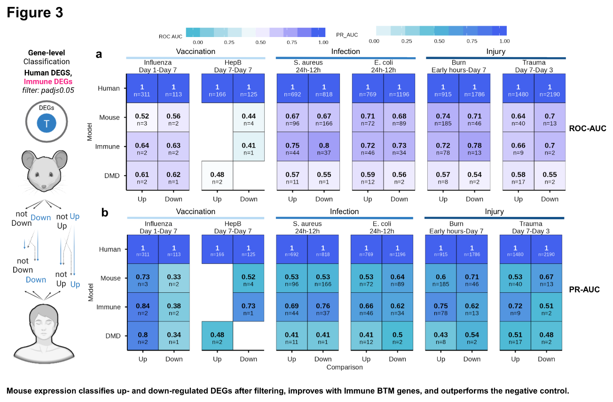

::: {.callout-note}
**Editable Quarto edition.** Every chart is written in R (`plotly` / `ggplot2`
/ `DT`) from the data in `docs/article-data/` — change the code and re-render
with `quarto render article-explore.qmd`. The hand-built edition with the same
content is [`article-explore.html`](article-explore.html).
:::

```{r setup}
#| include: false
.libPaths(c(file.path(here::here(), "renv", "library", "linux-zorin-noble", "R-4.6"), .libPaths()))
suppressPackageStartupMessages({
  library(dplyr); library(tidyr); library(jsonlite)
  library(plotly); library(DT); library(ggplot2)
})

PAL <- c("#2e9db7", "#4361ee", "#7b8fe0", "#6b9e5f", "#d98a35", "#c94f86", "#3f9c86", "#8b6fd6")

read_data <- function(file) {
  path <- file.path(here::here("docs", "article-data"), file)
  as_tibble(fromJSON(path, flatten = TRUE))
}
```

## 01 · Data curation {#curation}

From every immunization dataset available, only a handful matched across species.

```{r}
#| fig-height: 5
genus <- read_data("fig1-genus.json")

plot_ly(genus, x = ~datasets, y = ~reorder(genus, datasets),
        type = "bar", orientation = "h",
        marker = list(color = ifelse(genus$genus %in% c("Homo", "Mus"), PAL[1], PAL[3])),
        text = ~datasets, textposition = "outside",
        hovertemplate = "%{y}: %{x} datasets<extra></extra>") |>
  layout(title = "Immunization datasets by genus",
         xaxis = list(title = "datasets"), yaxis = list(title = ""),
         margin = list(l = 90, r = 30, t = 50, b = 40))
```

```{r}
sk <- read_data("fig1-sankey.json")
nodes <- unique(c(sk$source, sk$target))
plot_ly(type = "sankey",
        node = list(label = nodes, pad = 12, thickness = 16),
        link = list(source = match(sk$source, nodes) - 1,
                    target = match(sk$target, nodes) - 1,
                    value = sk$value)) |>
  layout(title = "From all datasets to the final cohorts")
```

```{r}
studies <- read_data("fig1-studies.json")
datatable(studies, rownames = FALSE, filter = "top",
          options = list(pageLength = 20, scrollX = TRUE, autoWidth = TRUE),
          caption = "Curated datasets — 20 per page, filter and sort as you like")
```

## 02 · Signal and noise {#conservation}

```{r}
#| fig-height: 6
dge <- read_data("fig2-dge.json") |>
  mutate(condition = paste0(pathogen, " · ", timepoint))

ggplotly(
  ggplot(dge, aes(x = n_sig, y = condition, fill = organism)) +
    geom_col(position = position_dodge(width = .7), width = .65) +
    facet_wrap(~ pathogen, scales = "free_y", ncol = 2) +
    scale_fill_manual(values = PAL[1:2]) +
    labs(x = "DEGs (adj. p < 0.05)", y = NULL, fill = NULL) +
    theme_minimal(base_size = 11),
  height = 640)
```

```{r}
plot_ly(dge, x = ~median_se, y = ~median_abs_l2fc, color = ~organism,
        type = "scatter", mode = "markers", colors = PAL[1:2],
        marker = list(size = 10, opacity = .8),
        text = ~paste(pathogen, timepoint),
        hovertemplate = "%{text}<br>median SE %{x:.2f}<br>median |log2FC| %{y:.2f}<extra></extra>") |>
  layout(title = "Noise vs effect size",
         xaxis = list(title = "median standard error"),
         yaxis = list(title = "median |log2FC|"))
```

## 03 · Classification {#classification}

```{r}
#| echo: false
#| fig-align: center

```

The interactive ROC/PR matrices are in preparation; the full-resolution figure
is in the [complete article](article.html#fig-3).

## 04 · Functional modules {#modules}

```{r}
#| fig-height: 7
gc <- read_data("fig4-genecorr.json")
meta <- read_data("fig4-genecorr-meta.json") |>
  mutate(lab = sprintf("%s\n(n = %s)", pathogen, format(n, big.mark = ",")))
gc <- gc |> left_join(meta |> select(pathogen, lab), by = "pathogen")

ggplotly(
  ggplot(gc, aes(lfc_mouse, lfc_human, color = same,
                 text = paste0(gene, "<br>log2FC mouse ", round(lfc_mouse, 2),
                               " · human ", round(lfc_human, 2)))) +
    geom_point(alpha = .35, size = .7) +
    geom_abline(slope = 1, intercept = 0, linetype = "dashed", color = "black", linewidth = .4) +
    coord_cartesian(xlim = c(-5, 5), ylim = c(-5, 5)) +
    facet_wrap(~ lab, ncol = 3, scales = "free") +
    scale_color_manual(values = c(`FALSE` = PAL[6], `TRUE` = PAL[1])) +
    labs(x = "log2FC mouse", y = "log2FC human", color = NULL) +
    theme_minimal(base_size = 11),
  height = 560, tooltip = "text")
```

```{r}
#| fig-height: 6
btm <- read_data("fig4-btm.json") |>
  filter(is.finite(nes_mouse), is.finite(nes_human))

plot_ly(btm, x = ~nes_mouse, y = ~nes_human, color = ~group,
        type = "scattergl", mode = "markers", colors = PAL,
        marker = list(size = 7, opacity = .75),
        text = ~paste(process, "<br>", pathogen, timepoint_comparison, "<br>", status),
        hovertemplate = "%{text}<br>NES mouse %{x:.2f} · human %{y:.2f}<extra></extra>") |>
  layout(title = "Cross-species module correlation (BTM NES)",
         xaxis = list(title = "NES mouse"), yaxis = list(title = "NES human"))
```

```{r}
#| fig-height: 7
shared <- btm |>
  group_by(process) |>
  summarise(pct = mean(percent, na.rm = TRUE), .groups = "drop") |>
  filter(is.finite(pct)) |>
  slice_max(pct, n = 22) |>
  mutate(process = reorder(process, pct))

plot_ly(shared, x = ~pct, y = ~process, type = "bar", orientation = "h",
        marker = list(color = ifelse(shared$pct >= 70, PAL[1],
                              ifelse(shared$pct >= 45, PAL[3], PAL[2]))),
        text = ~round(pct), textposition = "outside",
        hovertemplate = "%{y}: %{x:.0f}% shared<extra></extra>") |>
  layout(title = "Shared leading-edge genes per module (%)",
         xaxis = list(title = "% shared", range = c(0, 105)), yaxis = list(title = ""),
         margin = list(l = 200, r = 30, t = 50, b = 40))
```

## 05 · Evolution and regulation {#evolution}

```{r}
#| fig-height: 5
evo <- read_data("fig6-evolution.json")
bins <- read_data("fig6-evolution-bins.json")

plot_evolution <- function(var) {
  pts <- evo[is.finite(evo[[var]]) & is.finite(evo$abs_log2fc_diff), ]
  b <- bins[bins$var == var, ] |> arrange(x)
  name <- if (var == "dist_k80") "Kimura K80 distance" else "protein identity (%)"
  plot_ly() |>
    add_markers(data = pts, x = pts[[var]], y = pts$abs_log2fc_diff,
                marker = list(size = 4, color = PAL[3], opacity = .35),
                text = pts$gene, name = "genes",
                hovertemplate = paste0("<b>%{text}</b><br>", name, " %{x:.2f}<br>|dLog2FC| %{y:.2f}<extra></extra>")) |>
    add_lines(data = b, x = ~x, y = ~y, name = "binned mean",
              line = list(color = PAL[1], width = 3), inherit = FALSE) |>
    layout(title = paste(name, "vs expression divergence"),
           xaxis = list(title = name), yaxis = list(title = "|Δlog2FC|"))
}
subplot(plot_evolution("identity_human2mouse"), plot_evolution("dist_k80"),
        nrows = 1, shareY = TRUE, titleX = TRUE, titleY = TRUE)
```

```{r}
#| fig-height: 5
reg <- read_data("fig6-regulation.json") |>
  mutate(label = paste0(var, " — ", bin)) |>
  arrange(y) |>
  mutate(label = factor(label, levels = label))

plot_ly(reg, x = ~y, y = ~label, type = "bar", orientation = "h",
        marker = list(color = ifelse(reg$y > 1.1, PAL[2], PAL[1])),
        text = ~round(y, 2), textposition = "outside",
        hovertemplate = "%{y}<br>mean |dLog2FC| %{x:.2f}<br>n = %{customdata}<extra></extra>",
        customdata = ~n) |>
  layout(title = "Expression divergence by regulatory class",
         xaxis = list(title = "mean |Δlog2FC|"), yaxis = list(title = ""),
         margin = list(l = 220, r = 40, t = 50, b = 40))
```

```{r}
#| fig-height: 4
cre <- read_data("fig6-cre.json")
cre$category <- factor(cre$category, levels = c("PLS", "pELS", "dELS", "CTCF-bound", "not-CTCF"))

plot_ly(cre, x = ~category, y = ~n, type = "bar",
        color = ~group, colors = PAL[1:2],
        customdata = ~mean_abs_diff,
        hovertemplate = "%{x}<br>n = %{y:,}<br>mean |dLog2FC| = %{customdata:.2f}<extra></extra>") |>
  layout(title = "CRE types and CTCF (all genes, not split by same/different)",
         xaxis = list(title = ""), yaxis = list(title = "genes"),
         legend = list(title = list(text = "")))
```

## 06 · The multilayer model {#model}

```{r}
#| fig-height: 5
perf <- read_data("fig7-perf.json")
plots <- lapply(unique(perf$task), function(tk) {
  sub <- perf |> filter(task == tk)
  metric <- if (all(sub$metric == "rsq")) "R²" else "ROC-AUC"
  plot_ly(sub, x = ~model, y = ~value, color = ~feature_set, type = "bar", colors = PAL) |>
    layout(title = paste(tk, "·", metric), barmode = "group",
           xaxis = list(title = ""), yaxis = list(title = metric))
})
subplot(plots, nrows = length(plots), shareX = FALSE, titleY = TRUE, margin = 0.06)

datatable(perf, rownames = FALSE, filter = "top",
          options = list(pageLength = 10, scrollX = TRUE, autoWidth = TRUE),
          caption = "All model × feature-set metrics")
```

```{r}
#| fig-height: 5
imp <- read_data("fig7-importance.json")
use <- imp |> filter(task == unique(task)[1])
use <- use |> filter(feature_set == tail(unique(feature_set), 1)) |>
  slice_max(importance, n = 15) |> arrange(importance) |>
  mutate(feature_name_original = factor(feature_name_original, levels = feature_name_original))

plot_ly(use, x = ~importance, y = ~feature_name_original, type = "bar", orientation = "h",
        marker = list(color = PAL[1]),
        hovertemplate = "%{y}: %{x:.3g}<extra></extra>") |>
  layout(title = paste("Feature importance —", unique(use$task)),
         xaxis = list(title = "importance"), yaxis = list(title = ""),
         margin = list(l = 170, r = 30, t = 50, b = 40))
```

```{r}
#| fig-height: 6
genes <- read_data("fig7-genes.json")

ggplotly(
  ggplot(genes, aes(rank_human, pred_rank, color = sign_concordant,
                    text = paste0(hgnc_symbol, "<br>obs ", round(rank_human),
                                  " · pred ", round(pred_rank)))) +
    geom_point(alpha = .4, size = .8) +
    facet_wrap(~ pathogen, ncol = 3) +
    scale_color_manual(values = c(`FALSE` = PAL[6], `TRUE` = PAL[1])) +
    labs(x = "observed rank (human)", y = "predicted rank", color = NULL) +
    theme_minimal(base_size = 11),
  height = 620, tooltip = "text")

datatable(genes, rownames = FALSE, filter = "top",
          options = list(pageLength = 10, scrollX = TRUE),
          caption = "All genes — filter by symbol, pathogen, condition or status")
```

```{r}
priority <- read_data("fig7-priority.json")
datatable(priority, rownames = FALSE, filter = "top",
          options = list(pageLength = 10, scrollX = TRUE),
          caption = "Priority convergent genes")
```

## 07 · Take-aways {#numbers}

::: {.columns}
::: {.column width="25%"}
### 0.23
R² · human rank transfer (random forest)
:::
::: {.column width="25%"}
### 0.85
ROC-AUC · directional concordance
:::
::: {.column width="25%"}
### 0.62
ROC-AUC · shared leading-edge genes
:::
::: {.column width="25%"}
### 8,742
genes scored out-of-fold
:::
:::

[Read the full article →](article.html){.btn} · [Open the polished Explore edition →](article-explore.html){.btn}
