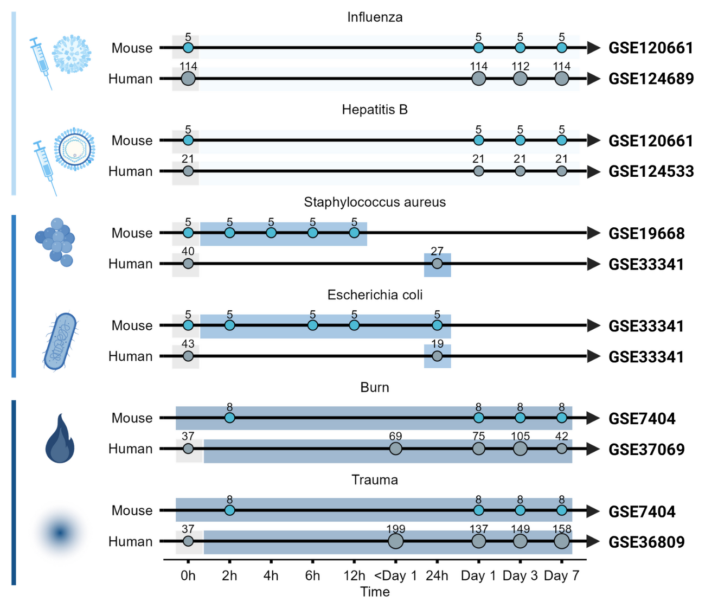
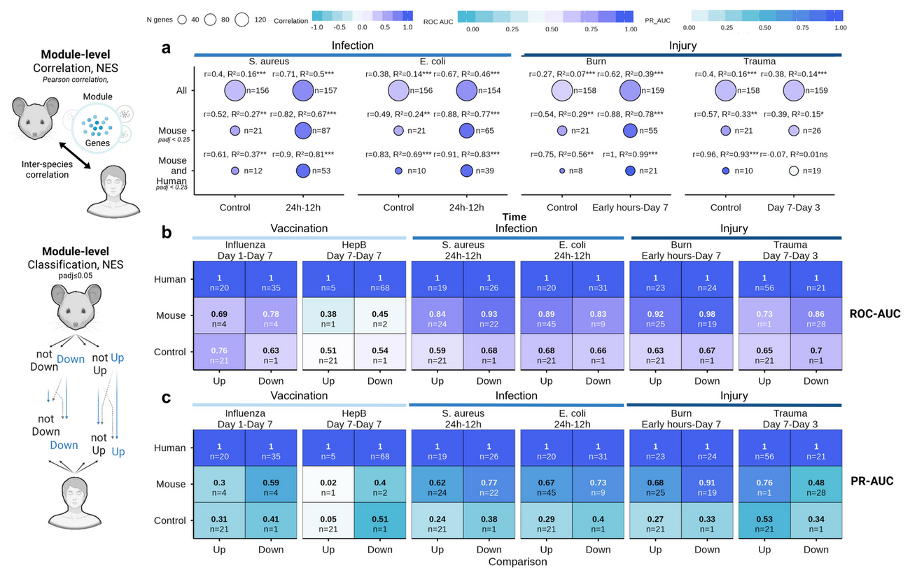
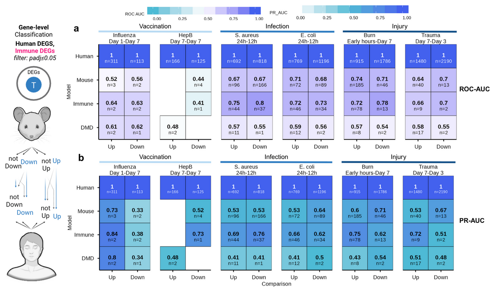

## 01 · The problem

::: head
Mice are the workhorse — but how well do they *actually* predict human
immunity?
:::

- Murine models underpin preclinical vaccine research, yet their
  translational value remains **contested**, contributing to clinical
  trial failures.
- Prior cross-species comparisons were largely **descriptive**:
  gene-centric, linear, and disconnected from sequence evolution and
  cis-regulatory architecture.
- The consequence: **contradictory reports** and no practical framework
  to prioritise targets for human translation.

::::: stats
::: stat
[201]{.num}[mouse immunization datasets screened from GEO (Fig.
1a)]{.lab}
:::

::: stat
[6]{.num .ink}[matched mouse–human conditions carried forward]{.lab}
:::
:::::

::: notes
Frame the problem: mice are the dominant preclinical model, but their
predictive value is contested and the literature is contradictory.
Crucially, previous comparisons were descriptive and disconnected from
genomic architecture — nobody linked conservation to sequence evolution
or cis-regulation.
:::

## 02 · Study design

::::::: columns
:::: {.column width="50%"}
::: head
One framework, three stimulus categories, matched across species
:::

- **Vaccination** — Fluad® (influenza), Engerix B® (hepatitis B)
- **Infection** — *S. aureus*, *E. coli*
- **Injury** — burn, trauma-haemorrhage
- **+ DMD** (mdx mouse) as a biological negative control

Blood transcriptomes · GEO / BioProject  limma + empirical Bayes ·
covariates (age, sex, ethnicity)  human downsampled to n = 5, 200
iterations, median statistics

::::

:::: {.column width="50%"}
::: fig

Fig. 1b — experimental timelines for matched mouse and human datasets
across vaccination, infection and injury (GSE120661 · GSE124689 ·
GSE19668 · GSE33341 · GSE7404 · GSE37069 · GSE36809).

:::
::::
:::::::

::: notes
Design: three stimulus categories — vaccination, acute infection and
injury — each with matched mouse and human blood transcriptomes. DMD
(mdx) is our biological negative control. Everything is harmonised:
limma with empirical Bayes, covariate adjustment, and iterative
downsampling of human subjects to n = 5 over 200 iterations to remove
pseudo-significance.
:::

## 03 · Result — analytical granularity

::::::::: columns
:::::: {.column width="50%"}
::: head
Cells disagree. Pathways *agree*.
:::

:::: stats
::: stat
[0.89–0.97]{.num}[module-level (BTM NES) Pearson correlation between
species]{.lab}
:::
::::

- Gene-level effect sizes correlate only **moderately**; module
  activation is **highly conserved**.
- Shared leading-edge genes = **67.5–79%** of mouse LEGs in enriched
  modules (70.5% pooled).
- Collapsing dimensionality into BTMs **reduces noise** and exposes a
  robust translational signature.
::::::

:::: {.column width="50%"}
::: fig

Fig. 4a–c — BTM module-level correlation (a) and classification
performance (b, c) across conditions. · Fig. 5a — shared leading-edge
genes across BTM process categories.

:::
::::
:::::::::

::: notes
First result: granularity matters. Individual orthologous genes
correlate only moderately, but when we collapse the transcriptome into
Blood Transcription Modules the correlation jumps to 0.89–0.97 (trauma
being the exception). Shared leading-edge genes account for 67.5–79% of
mouse LEGs — the translational signal lives in the leading edge, not in
all genes.
:::

## 04 · Result — stimulus intensity & kinetics

::: head
Translatability scales with the *strength* of the perturbation
:::

::::::: columns
:::: {.column width="50%"}
::: {.panel .strong}

Infection & injury — conserved

ρ = 0.41–0.59

Acute *S. aureus*, *E. coli* and burn engage evolutionarily stable,
highly conserved programs.

Effect-size difference (\|ΔLog2FC\|) significantly smaller than negative
controls — WMW adjusted P \< 1 × 10⁻¹⁵.
:::
::::

:::: {.column width="50%"}
::: {.panel .weak}

Single-dose vaccination — diverges

ρ = −0.32–0.27

Fluad® and Engerix B® fail to reach the systemic activation threshold,
remaining near baseline controls.

Preclinical immunogenicity may require **boosters or stronger
adjuvants** to emerge from species-specific noise.
:::
::::
:::::::

Timing ≠ chronology · mouse 2–6 h matches the human peak inflammatory
window (days 1–3) → align by biological equivalence

::: notes
Second result: translatability scales with the strength of the
perturbation. Acute bacterial infection and severe injury engage
conserved core mammalian programs (rho 0.41–0.59), whereas single-dose
subunit/inactivated vaccines stay near baseline (rho −0.32 to 0.27). And
timing rarely matches chronologically: mouse 2–6 h aligns with the human
days 1–3 window.
:::

## 05 · Result — classification performance

:::::::::: columns
::::::: {.column width="48%"}
::: head
Mouse signatures call human direction — best at *module* level
:::

::::: {.stats style="flex-direction: column; gap: .5em;"}
::: stat
[0.84–0.98]{.num}[ROC-AUC · mouse BTM signatures classifying human
module regulation]{.lab}
:::

::: stat
[0.64–0.74]{.num .ink}[ROC-AUC · gene-level mouse signatures in
infection & injury]{.lab}
:::
:::::

Biological negative control (DMD): ROC-AUC 0.48–0.61 — near random

:::::::

:::: {.column width="52%"}
::: fig

Fig. 3a–b — ROC-AUC and PR-AUC matrices for mouse signatures classifying
up- and downregulated human genes, with human self-prediction and the
DMD negative control.

:::
::::
::::::::::

::: notes
Third result: prediction. Mouse signatures classify the direction of
human gene regulation, but module-level models clearly beat gene-level
ones — 0.84–0.98 ROC-AUC versus 0.64–0.74 — and both beat the DMD
negative control (0.48–0.61). Downregulation is easier to predict than
upregulation at early time points.
:::

## 06 · Result — evolution & regulation

::::::::: columns
:::::: {.column width="52%"}
::: head
Why genes *diverge*
:::

Small per-gene effects, but a consistent direction: sequence constraint
tracks **stability**; regulatory plasticity tracks **divergence**.

::: {.panel .strong}

Associated with lower \|ΔLog2FC\|

- Higher protein sequence identity [rho = −0.08]{.mono}
- Greater TF availability and TF sharing [rho = −0.017 / −0.013]{.mono}
- Conserved promoter-like (PLS) signatures [n.s.]{.mono}
:::

::: {.panel .weak}

Associated with higher \|ΔLog2FC\|

- Greater Kimura (K80) evolutionary distance [rho = 0.10]{.mono}
- Enhancer multiplicity — pELS / dELS counts [rho = 0.036 /
  0.039]{.mono}
- CRE turnover and CTCF-bound pELS [bound rho = 0.042]{.mono}
:::
::::::

:::: {.column width="48%"}
::: fig

Fig. 6a–e — protein sequence identity and Kimura distance (a),
transcription factor availability (b), cis-regulatory element abundance
(c), CRE conservation and turnover (d) and CTCF binding (e) against
\|ΔLog2FC\|.

:::
::::
:::::::::

::: notes
Fourth result: why individual genes diverge. Coding-sequence constraint
and trans-regulatory availability reduce expression divergence, while
enhancer multiplicity and CRE turnover increase it. The association is
small in magnitude but highly significant, and it is directional:
sequence constraint ↔ stability; regulatory plasticity ↔ divergence.
:::

## 07 · Result — multilayer modelling

::::::: columns
:::: {.column width="48%"}
::: head
Layers turn near-chance transfer into *useful* prediction
:::

- Mouse rank alone: **R² = 0.001** · mouse direction alone: **ROC-AUC
  0.511** — no transfer.
- 
  - evolution, TF, CRE and BTM layers → random forest **R² = 0.234** for
    human rank and **ROC-AUC = 0.849** for direction.
- Shared vs mouse-only LEGs stay hard: lasso best by a whisker
  (**0.617** predictive / **0.627** explanatory).

LOCO-CV (4 folds) · nested layers: DGE Baseline → Full + BTM  4
algorithms: linear/logistic · lasso · random forest · neural network

::::

:::: {.column width="52%"}
::: fig

Fig. 7 — multilayer modelling: (a) layer integration workflow, (b)
shared-LEG classification, (c) directional concordance and (d) human
rank regression, across algorithms and feature layers.

:::
::::
:::::::

::: notes
Fifth result: the multilayer model. Mouse rank and direction alone do
not transfer at all — R² = 0.001 and ROC-AUC 0.511. Adding the
biological layers raises the random forest to R² = 0.234 for human rank
and 0.849 for directional concordance. Shared-LEG classification stays
hard; the lasso is only marginally best there (0.617/0.627). Everything
is evaluated by leave-one-condition-out cross-validation, so every gene
is scored by a model that never saw its pathogen.
:::

## 08 · Take-aways & limitations

::: head
Translatability is a function of *granularity*, *intensity* and *timing*
:::

::::::: columns
:::: {.column width="50%"}
::: {.panel .strong}

What the study establishes

- Module-level analysis beats gene-level analysis for cross-species
  concordance.
- Acute infection and injury translate; single-dose vaccination does
  not.
- Evolutionary and regulatory layers carry a conserved signal beyond
  mouse DGE.
- Four out-of-fold scores — [score_shared]{.mono}, [score_rank]{.mono},
  [score_direction]{.mono}, [score_translational]{.mono} — prioritise
  candidate genes.
:::
::::

:::: {.column width="50%"}
::: {.panel .weak}

Limitations to keep in mind

- Small murine cohorts; scarce harmonised metadata.
- Two inbred strains only (C57BL/6, CB6F1) — strain choice shapes
  translatability.
- Single-dose mouse vaccination vs. human prime-boost regimens.
- Blood-based BTMs and one-to-one Ensembl orthologs — needs testing in
  other tissues and gene sets.
:::
::::
:::::::

::: notes
Take-aways: translatability is not a fixed property of the mouse; it is
a function of granularity, stimulus intensity and temporal alignment.
The model outputs four complementary scores that can be used to
prioritise genes. Be honest about the limitations: small murine cohorts,
two inbred strains, single-dose vaccines, blood only, and one-to-one
orthologs only.
:::

## 09 · Availability

::: head
Open code, trained models, and a notebook to *apply* them
:::

::::::::: columns
:::: {.column width="33%"}
::: card
[Pipeline]{.idx}

mousetohuman_multilayer

Full R Markdown pipeline — curation, QC, limma DGE, GSEA, evolutionary
and regulatory analyses, and the LOCO modelling script. Pinned with
`renv`.

[github.com/wapsyed/mousetohuman_multilayer]{.url}
:::
::::

:::: {.column width="33%"}
::: card
[Documentation]{.idx}

Project site

Overview, complete methodology — including the multilayer modelling
pipeline — and the notebook map, in one place.

[wapsyed.github.io/mousetohuman_multilayer]{.url}
:::
::::

:::: {.column width="34%"}
::: card
[Apply it]{.idx}

mousetohuman_predict

Step-by-step notebook: from DGE input to GSEA, model prediction and
visualisation of the four translational scores. Runs in RStudio via
Binder.

[github.com/wapsyed/mousetohuman_predict]{.url}
:::
::::
:::::::::

Thank you — questions welcome.

::: notes
Close by pointing to the deliverables: the full open-source pipeline,
the project site that documents the methodology and the notebook map,
and the step-by-step notebook that applies the trained models to a new
mouse dataset — runnable in the browser via Binder. Everything is open
so the community can audit and retrain.
:::
