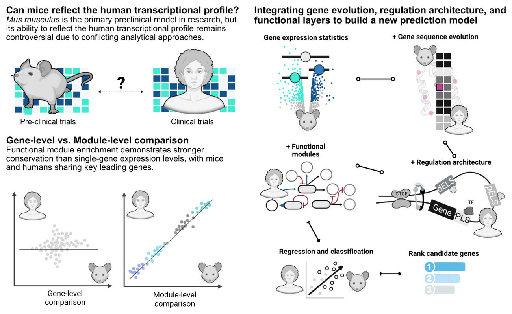
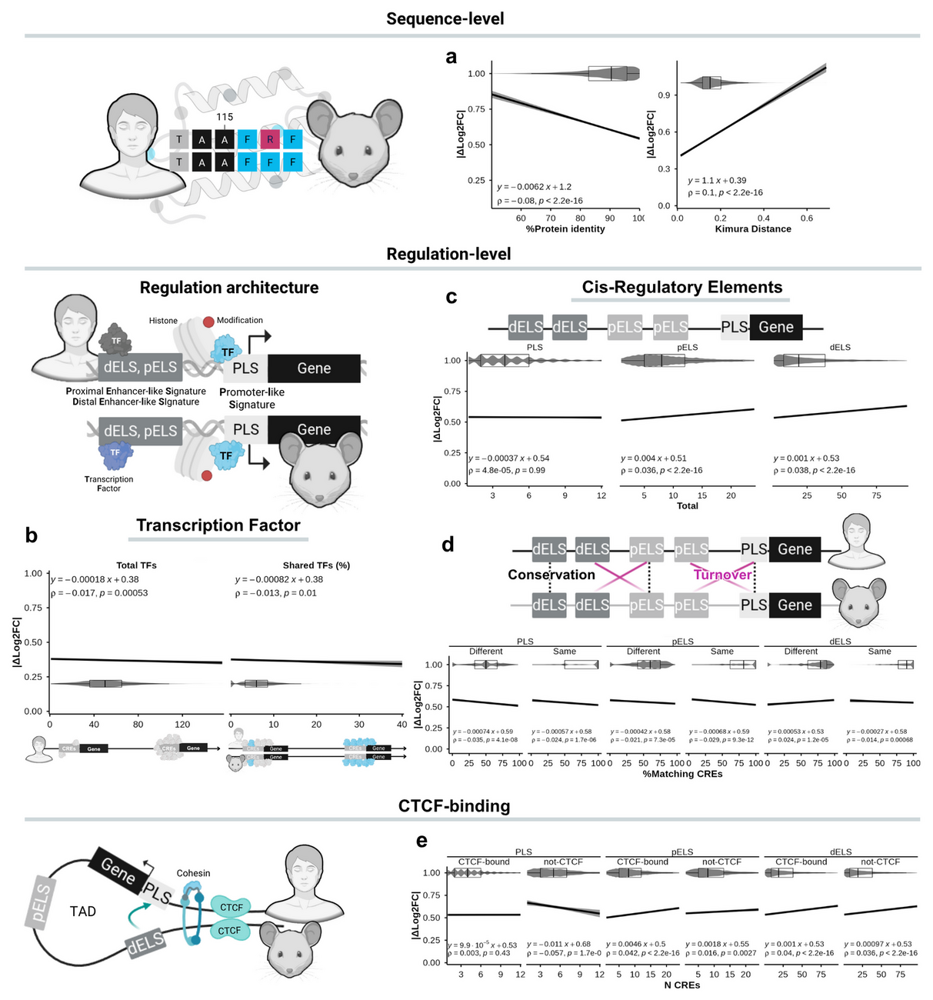
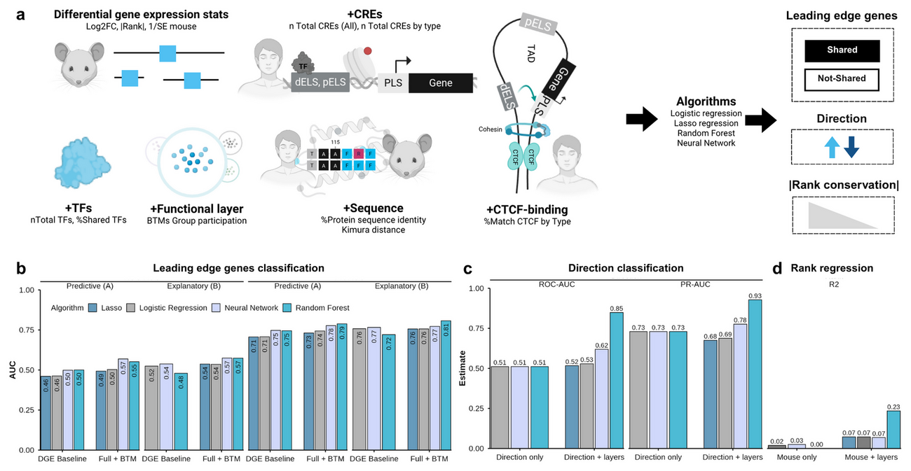

## From mice to humans {.titleslide}

<p class="kicker">

A multi-omic predictive framework for translational immunology — **detailed
report version**, prepared for reading rather than live presentation

</p>

<p class="byline">

Wasim Aluísio Prates-Syed · Lira AA · Cortes N · Silva JDQ · Hamaguchi B
· Carvalho E · Castillo-Chávez A · Durães-Carvalho R · Cabral-Marques O
· Sabino EC · Krieger JE · Hagan T · Cabral-Miranda G

</p>

<p class="affil">

Laboratory of Genetics and Molecular Cardiology, InCor —
FMUSP<br>September 2026

</p>

::: fig

:::

::: notes
This is the report-style version of the Mouse2Human deck: it keeps the same
paper palette, Merriweather headings and Arial body as the lab-meeting deck but
carries far more text, one topic per slide, and a full speaker-note block on
every slide. It is meant to be read, not presented live. The graphical abstract
on the right summarises the three stimulus categories, the multilayer model and
the four translational scores. Everything in this deck is drawn from the
manuscript and project documentation — no new numbers are introduced.
:::

## About this report

:::::: columns
::::: {.column width="50%"}
::: head
A reading deck, not a talk
:::

- This is the dense companion to the 10-slide lab-meeting deck: same visual
  system, more text, one topic per slide.
- Class conventions are identical to the reference deck — `head` blocks, two
  columns, `fig` blocks with captions, `stats`/`stat` counters, `panel`
  comparisons, `card` blocks and `notes`.
- Sources: `METHODOLOGY.md` (sections I–XII), `README.md`, `overview.html` and
  `code-planning.html` on the project site.

<p class="mono">

Palette #4DBBD5 · #000000 · #4361ee · #A1B0F7<br>Merriweather headings ·
Arial body · monospace only for code and accessions

</p>
:::::
::::: {.column width="50%"}
::: head
How to read it
:::

- Numbered slides (`01 · …`) follow the manuscript logic: question → data →
  harmonisation → results → modelling → availability → limitations.
- **Bold** marks load-bearing facts; *italics* mark species or emphasis.
- Grey monospace side-notes carry protocols, file names and accessions.
- Every figure keeps the study's own panel caption (`Fig. …`) so plots stay
  traceable to the manuscript.
:::::
::::::

::: notes
Use this slide to orient the reader before the substance begins. The deck is
organised in the same order as the methods: the question and design, the cohort
construction and harmonisation, the granularity and intensity results, the
classification benchmark, the evolutionary and regulatory layers, the multilayer
model, and finally availability and limitations. The visual grammar is copied
verbatim from the lab-meeting deck so the two decks feel like one family.
:::

## Abstract — executive summary {.bigstats}

::: head
Modules travel; genes do not.
:::

Blood transcriptomes from matched mouse and human challenge studies were
compared across vaccination, acute bacterial infection and sterile injury. At the
level of individual orthologous genes the agreement was only moderate, but once
the transcriptome was collapsed into Blood Transcription Modules the
cross-species signal became strong and stable. Translational accuracy then scaled
with the **strength of the perturbation**, and adding **sequence-evolution,
transcription-factor and cis-regulatory layers** turned a near-chance mouse
baseline into useful prediction.

:::: stats
::: stat
[0.89–0.97]{.num}[module-level (BTM NES) cross-species Pearson correlation]{.lab}
:::

::: stat
[0.85]{.num .ink}[random-forest ROC-AUC for directional concordance, LOCO]{.lab}
:::
::::

::: notes
This single slide is the whole paper compressed. The two headline numbers are
the module-level correlation between species (0.89–0.97, with trauma the
exception) and the random-forest directional ROC-AUC of 0.85 under
leave-one-condition-out cross-validation. The narrative between them is that
granularity, stimulus intensity and timing determine how well a mouse study
predicts a human one, and that the biological layers recover a conserved signal
that mouse effect sizes alone do not carry.
:::

## Roadmap & analytical trajectory

:::::: columns
::::: {.column width="46%"}
::: head
Seven sections, one argument
:::

- **I–II · Question, aims & cohorts** — 6 matched conditions from 201 screened
  datasets; DMD as a biological negative control.
- **III · Harmonisation** — normalisation, probe collapsing, QC, limma with
  empirical Bayes, covariate control and downsampling.
- **IV–VI · Results** — granularity, stimulus intensity and kinetics, and the
  ROC/PR classification benchmark.
- **VII–VIII · Mechanism** — protein-coding evolution and cis-regulatory
  architecture.
- **IX · Multilayer modelling** — LOCO cross-validation, four algorithms, four
  translational scores.
- **X–XII · Limits, availability, references.**
:::::
::::: {.column width="54%"}
::: head
End-to-end pipeline
:::

- **0 · Data curation** — BioProject / GEO scan and inclusion–exclusion.
- **1 · Standardize** — download, platform normalisation, probe collapse,
  ortholog mapping.
- **1.1 · Quality control** — `arrayQualityMetrics`, SA/MA and RLE diagnostics.
- **2 · Differential expression** — `limma` vs. t-test, combined across species.
- **3 · Comparison** — DGE, GSEA and functional analyses.
- **4 · Performance** — ROC / PR / AUC against DMD and permutation nulls.
- **5 · Evolutionary** — protein sequence and cis-regulatory regulation.
- **6 · Modelling** — `tidymodels` LOCO mouse-to-human transfer.

<p class="mono">

Notebook order: 0, 1, 1.1, 2, 3.1, 3.2, 3.3, 4, 5.1, 5.2, 6 ·
support: `required.R`, `FIT_Exploration_Prediction.Rmd`,
`ImmuneGO_Mouse.Rmd`, `Tests.Rmd`

</p>
:::::
::::::

::: notes
The left column is the manuscript's section order; the right column is the
executable notebook order documented on the project site. They map onto each
other but are not identical: the manuscript groups the results thematically,
whereas the pipeline is strictly sequential. Keeping both in view helps a reader
move from a result back to the exact script that produced it. The eight-stage
ribbon on the code-planning page is the same trajectory.
:::

## 01 · The translational conundrum

::: head
Mice are the workhorse — but how well do they *actually* predict human immunity?
:::

- Murine models underpin preclinical vaccine research, yet their translational
  value remains **contested**, contributing to clinical trial failures.
- Prior cross-species comparisons were largely **descriptive**: gene-centric,
  linear, and disconnected from sequence evolution and cis-regulatory
  architecture.
- The consequence: **contradictory reports** and no practical framework to
  prioritise targets for human translation.

:::: stats
::: stat
[201]{.num}[mouse immunization datasets screened from GEO (Fig. 1a)]{.lab}
:::

::: stat
[6]{.num .ink}[matched mouse–human conditions carried forward]{.lab}
:::
::::

::: notes
Frame the problem: mice are the dominant preclinical model, but their predictive
value is contested and the literature is contradictory. Crucially, previous
comparisons were descriptive and disconnected from genomic architecture — nobody
linked conservation to sequence evolution or cis-regulation. The scale of the
screening exercise matters: 201 mouse immunization datasets were retrieved, but
only a handful matched human data well enough to compare directly.
:::

## 02 · Hypothesis & key findings

::: head
Higher-order structures are conserved even when single genes diverge
:::

:::::: columns
::::: {.column width="50%"}
**Core question.** To what degree do murine models accurately mirror human blood
transcriptomic dynamics during vaccination, acute bacterial infection and
systemic sterile injury?

**Central hypothesis.** Functional pathways, Blood Transcription Modules and
coordinated gene networks are evolutionarily conserved across species, retaining
high predictive fidelity **even when individual gene effect sizes diverge**.
:::::
::::: {.column width="50%"}
**Four findings (as reported).**

1. **Modules beat genes** — module-level correlations exceeded gene-level
   correlations in every condition.
2. **Intensity matters** — acute infection and injury engaged conserved
   signatures; single-dose vaccination diverged.
3. **Layers add signal** — sequence evolution, TF features, CRE architecture,
   CTCF status and BTM membership raised the random forest to R² = 0.23 and
   ROC-AUC = 0.85.
4. **Divergence is regulatory** — expression divergence tracked promoter/enhancer
   turnover and TF sharing rather than protein-coding identity or codon
   evolution.
:::::
::::::

::: notes
This slide states the question, the hypothesis and the four findings the rest of
the deck will unpack. The logic is deliberately staged: first show that the
signal lives at module level, then show it depends on stimulus strength, then show
which additional biological layers recover it, and finally localise the source of
divergence to the regulatory rather than the coding genome. Each of the four
findings gets its own section later.
:::

## 03 · Study design

:::::: columns
::::: {.column width="45%"}
::: head
One framework, three stimulus categories, matched across species
:::

- **Vaccination** — Fluad® (influenza), Engerix B® (hepatitis B)
- **Infection** — *S. aureus*, *E. coli*
- **Injury** — burn, trauma-haemorrhage
- **+ DMD** (mdx mouse) as a biological negative control

<p class="mono">

Blood transcriptomes · GEO / BioProject<br> limma + empirical Bayes ·
covariates (age, sex, ethnicity)<br> human downsampled to n = 5, 200
iterations, median statistics

</p>
:::::
::::: {.column width="55%"}
::: fig


<p class="cap">

Fig. 1b — experimental timelines for matched mouse and human datasets
across vaccination, infection and injury (GSE120661 · GSE124689 ·
GSE19668 · GSE33341 · GSE7404 · GSE37069 · GSE36809).

</p>
:::
:::::
::::::

::: notes
Design: three stimulus categories — vaccination, acute infection and injury —
each with matched mouse and human blood transcriptomes. DMD (mdx) is the
biological negative control. Everything is harmonised: limma with empirical Bayes,
covariate adjustment, and iterative downsampling of human subjects to n = 5 over
200 iterations to remove pseudo-significance. The timelines in Fig. 1b show why
timing alignment is not automatic — the sampling schedules differ between
species.
:::

## 04 · Data sources — repository search strategy

:::::: columns
::::: {.column width="50%"}
::: head
From a broad mammalian net to a small matched set
:::

- **BioProject / GEO query** — vaccine terms (`"vaccine"`, `"vaccinated"`,
  `"vaccination"`, `"vaccines"`) combined with `"transcriptome gene expression"`,
  `"material transcriptome"`, `"capture_whole"` and `"org mammals"`, **excluding**
  *Homo sapiens*.
- **Organism restriction** — a second query isolated *Mus musculus*, excluding
  tumour, cancer and autoimmune records.
- **Assay restriction** — only `"Expression profiling by array"` and
  `"Expression profiling by high throughput sequencing"`.
:::::
::::: {.column width="50%"}
::: head
Manual annotation is the rate-limiting step
:::

- Only studies of **vaccines against human pathogens** were kept; BioProject and
  GEO records were merged via **PRJNA** accessions and split by **vaccine, sample
  source and RNA protocol**.
- Datasets with partial methods, or BCR/TCR repertoire only, were excluded.
- Records were annotated with `GEOquery` and curated against the publication,
  capturing source, condition, antigen, vaccine type, adjuvant, time points,
  doses, route and assay.

<p class="mono">

Where records conflicted with the publication, the GEO record was prioritised

</p>
:::::
::::::

::: notes
This slide documents the provenance of the data so the pipeline is auditable.
The search deliberately excluded human records in the first pass to find mouse
cohorts, then restricted to Mus musculus and to expression-profiling assays. The
manual annotation step is where most curation effort went, because adjuvants,
doses, routes and time points had to be recovered from publications and
reconciled with the GEO records. GEO was treated as authoritative when the two
disagreed.
:::

## 05 · From 201 datasets to 6 matched conditions {.bigstats}

::: head
Only a handful of murine cohorts met the bar for a direct comparison
:::

:::: stats
::: stat
[201]{.num}[mouse immunization datasets retrieved from GEO]{.lab}
:::

::: stat
[6]{.num .ink}[matched mouse–human conditions carried forward]{.lab}
:::
::::

<p class="mono">

GSE120661 (influenza + hepatitis B) was carried forward; GSE182858 (influenza
in "dirty" mice) could not be compared with the human cohort — sampling at 3 h
before/after immunisation vs. days 1, 3 and 7 — and was not used

</p>

::: notes
Of 201 mouse immunization datasets, only two microarray datasets matched the
human vaccination data by tissue, antigen, vaccine type, target condition, time
points and adjuvants. GSE120661 covered influenza and hepatitis B and was carried
forward. GSE182858, which studied influenza vaccination in "dirty" mice, was
excluded because its sampling schedule — three hours either side of immunisation
— could not be aligned with the human days 1, 3 and 7. This slide is the honest
bottleneck of the study: the matched set is small because the metadata rarely
line up.
:::

## 06 · The six matched mouse–human conditions

:::::: columns
::::: {.column width="50%"}
::: head
Vaccination & infection
:::

::: {.panel .strong}
<p class="ptitle">

Vaccination — subunit / inactivated

</p>

- **Influenza (Fluad®, TIV + MF59)** — human `GSE124689` · mouse `GSE120661`
- **Hepatitis B (Engerix B®)** — human `GSE124533` · mouse `GSE120661`
:::

::: {.panel .weak}
<p class="ptitle">

Acute bacterial infection

</p>

- ***S. aureus* bacteraemia** — human `GSE33341` · mouse `GSE19668`
- ***E. coli* sepsis** — human `GSE33341` · mouse `GSE33341`
:::
:::::
::::: {.column width="50%"}
::: head
Injury & negative control
:::

::: {.panel .strong}
<p class="ptitle">

Sterile injury

</p>

- **Severe burn** — human `GSE37069` · mouse `GSE7404`
- **Trauma-haemorrhage** — human `GSE36809` · mouse `GSE7404`
:::

::: {.panel .weak}
<p class="ptitle">

Biological negative control

</p>

- **Duchenne muscular dystrophy (mdx)** — mouse `GSE1025`, muscle tissue,
  peak pathological timepoint day 28.
:::
:::::
::::::

::: notes
These are the six matched conditions plus the negative control. Note the
tissue matrix: the vaccination and infection cohorts are blood or PBMC, while DMD
is muscle, which is exactly why it works as a specificity control rather than a
comparison of like with like. The platforms differ too — Agilent, Affymetrix
Human Gene 1.0 ST, U133 Plus 2.0 — which is why platform-specific normalisation
is needed before any comparison. The *E. coli* mouse and human blocks both come
from GSE33341, a caveat discussed later.
:::

## 07 · Mouse vaccination cohort metadata

:::::: columns
::::: {.column width="52%"}
::: head
GSE120661 — one series, four arms, six time points
:::

- **Time points:** 4, 8, 24, 48, 72 and 168 h (4 h → day 7).
- **Samples per arm:** 5; **single dose**; intramuscular route.
- **Tissue / assay:** PBMCs, microarray.

| Arm | Pathogen | Vaccine | Adjuvant |
|:---|:---|:---|:---|
| 1 | HBV | Engerix-B | Alum |
| 2 | HBV | Engerix-B | None |
| 3 | Influenza | Agrippal | None |
| 4 | Influenza | Fluad® | MF59 |
:::::
::::: {.column width="48%"}
::: head
Why this cohort matters
:::

- The four arms separate **pathogen, antigen, adjuvant and vaccine type** within
  a single experiment — a clean within-series contrast.
- Human counterparts are **prime-boost** regimens, whereas the mouse arms are
  **single-dose**, so the adaptive trajectory is not strictly comparable.
- The adjuvant contrast (MF59 vs. none; alum vs. none) is what lets the study
  separate *intensity* from *identity*.

<p class="mono">

GSE182858 (Quadri 2019-2020, IN route, ±Addavax) and GSE224584
(N. meningitidis ACWY, whole blood) illustrate the screened-but-unused periphery

</p>
:::::
::::::

::: notes
This slide gives the vaccination cohort in full because it is the arm that
turns out to be the hardest to translate. Six time points from four hours to one
week let the study follow early innate dynamics, but only a single dose was given
in mice. The four arms are valuable because they vary adjuvant and vaccine type
independently, which is how the analysis can attribute the divergence to weak
systemic activation rather than to species identity alone. GSE182858 and
GSE224584 are shown as examples of datasets that passed the screen but could not
be aligned with the human atlases.
:::

## 08 · Negative control — Duchenne muscular dystrophy

:::::: columns
::::: {.column width="50%"}
::: head
A perturbation that should *not* transfer to human blood
:::

- **Model:** mdx mouse, Duchenne muscular dystrophy; peak pathological timepoint
  **day 28**; muscle tissue (`GSE1025`, Affymetrix Murine U74A v2).
- Used to benchmark **specificity**: a classifier built on a disease that is
  neither an immune challenge nor a blood phenotype should perform near chance.
- The DMD model anchors the "negative" side of every ROC curve, so that high AUCs
  for infection and injury can be attributed to conservation rather than to
  methodological artefacts.

<p class="mono">

DMD ROC-AUC 0.48–0.61 — near random, as expected

</p>
:::::
::::: {.column width="50%"}
::: head
Two more control ideas on the record
:::

- The performance framework also compares against a **"perfect" model** that
  exactly replicates the human truth labels — the upper bound of the AUC.
- **Permutation null distributions** accompany the biological controls in the
  performance notebook (`4_Performance_DifferentTimepoints.rmd`).
- Together these three references (truth, DMD, permutation) let each reported
  AUC be read as a position on a continuum from chance to perfect transfer.
:::::
::::::

::: notes
DMD is not a fair cross-species comparison and is not meant to be: it is a
muscle disease in a mouse, so it should fail to predict human blood immune
responses. The value is diagnostic — if the DMD-based classifier also scored
well, the pipeline would be picking up a technical artefact rather than
biology. Alongside DMD, the ROC framework uses a perfect model as the ceiling and
permutation nulls as an additional reference, so every AUC has a clear scale.
:::

## 09 · Platform-specific normalisation

:::::: columns
::::: {.column width="50%"}
::: head
One normalisation scheme per technology
:::

- **Affymetrix oligonucleotide arrays** (e.g. Human Gene 1.0 ST): raw probe
  intensity `.CEL` files were preprocessed with **RMA** via `affy` / `oligo` —
  background correction, quantile normalisation and median-polish
  summarisation.
- **Illumina BeadChips & Agilent arrays:** between-array quantile normalisation
  (`limma::normalizeBetweenArrays(method = "quantile")`) to align empirical
  distributions while preserving biological rank order.
- Expression matrices were **log2-transformed** before modelling.
:::::
::::: {.column width="50%"}
::: head
Why not a single method
:::

- RMA is designed for the multi-probe structure of Affymetrix arrays; forcing it
  onto bead-level Illumina data, or quantile-normalising `.CEL` files before RMA,
  would violate each platform's noise model.
- The goal is **comparability of distributions**, not identity of algorithm:
  each cohort is normalised in its own native space, then mapped to orthologs.
- All preprocessing lives in `1_Download_Standardize_Datasets.Rmd`.

<p class="mono">

log2 intensity retained; no arbitrary truncation of effect sizes before modelling

</p>
:::::
::::::

::: notes
This slide explains a decision that looks inconsistent but is deliberate:
different normalisation for different platforms. Affymetrix data go through RMA
because that is the appropriate multi-array model, while Illumina and Agilent
arrays get between-array quantile normalisation. The point is to make
distributions comparable across samples within a cohort before any cross-species
comparison. Effect sizes are kept continuous at this stage to preserve power for
the rank-based pathway tests later.
:::

## 10 · Probe collapsing & ortholog mapping

:::::: columns
::::: {.column width="50%"}
::: head
One probe per gene, one ortholog per human gene
:::

- **Probe collapsing:** probes mapping to the same **Entrez ID** were collapsed by
  selecting the probe with the **highest median expression** — not averaging,
  which would dampen signal across non-responsive probes.
- **Human reference selection:** when several genes mapped to the same ortholog,
  the Entrez ID with the **highest median expression** was used as the reference.
- **Orthology:** protein-coding genes with **one-to-one orthology to human** from
  **MGI**; genes with multiple orthologs were **excluded**.
:::::
::::: {.column width="50%"}
::: head
Annotation sources & baseline
:::

- Platform annotation via Bioconductor packages (`illuminaHumanv4.db`,
  `hugene10sttranscriptcluster.db`) and `biomaRt`.
- Collapsed genes and their log2-fold changes enter the model as a **baseline
  contrast against pre-treatment** (0 h / day 0).
- The one-to-one requirement trades coverage for interpretability — it is also a
  limitation, because it discards duplicated and many-to-many orthologs.

<p class="mono">

Probes: highest median, not mean · Orthologs: MGI 1:1 only · Human ref: highest median Entrez

</p>
:::::
::::::

::: notes
Two collapsing decisions matter signal-wise. First, when several probes report the
same gene, the most responsive one is kept rather than the average, which would
blur a strong signal with silent probes. Second, mapping is restricted to
one-to-one MGI orthologs so that every human gene has at most one mouse partner,
keeping the cross-species comparison unambiguous. That restriction is a known
limitation: it excludes multi-ortholog families and could bias the gene set
toward well-annotated, conserved genes.
:::

## 11 · Quality control & outlier detection

:::::: columns
::::: {.column width="50%"}
::: head
Three complementary views of array quality
:::

- **Distribution diagnostics:** density plots, boxplots and scatterplots to
  inspect normalisation and between-sample comparability (`arrayQualityMetrics`,
  `limma`).
- **PCA:** used to spot outliers and batch effects. A subset of **human trauma
  samples** separated significantly and was **excluded** — the metadata could not
  identify a covariate cause, so it was hypothesised to reflect unreported trauma
  severity.
- **RLE:** `RLE_gi = log2(E_gi) − median_j(log2(E_gj))`; samples with anomalous
  IQR divergence or median shifts were flagged and removed where technical
  confounding was confirmed.
:::::
::::: {.column width="50%"}
::: head
The RLE statistic
:::

$$\text{RLE}_{gi} = \log_2(E_{gi}) - \operatorname{median}_{j}\big(\log_2(E_{gj})\big)$$

- A well-normalised sample has RLE medians near zero and comparable IQRs.
- The trauma exclusion is disclosed rather than silently dropped: it is a
  reminder that clinical metadata can be incomplete.
- QC outputs and diagnostics were archived (`tables/Quality control/`) so the
  decisions are reproducible.

<p class="mono">

1.1_QualityControl.Rmd · SA and MA plots · before-vs-processed summaries

</p>
:::::
::::::

::: notes
Quality control here is not cosmetic: it removed human trauma samples whose
separation could not be explained by any recorded covariate. That is a
scientifically cautious choice, because including them would inflate
between-sample variance and weaken the cross-species comparison, but it is also a
limitation because unreported severity remains a hidden confounder. PCA and RLE
play complementary roles — PCA is multivariate and catches structure, RLE is
per-sample and catches scale divergence. All diagnostics are archived for
reproducibility.
:::

## 12 · Differential expression with limma

:::::: columns
::::: {.column width="50%"}
::: head
Empirical Bayes moderation, condition by condition
:::

- **Low-abundance filter:** retain genes with **log2-intensity > 6 in at least
  five samples**.
- **Model:** an unintercepted design matrix, `Y_g = X β_g + ε_g`, with `X`
  parameterised by organism, stimulus and timepoint.
- **Contrasts:** each post-treatment timepoint against its matched pre-treatment
  baseline (e.g. day 1 − day 0, day 3 − day 0, day 7 − day 0).
- **Variance shrinkage:** `limma::eBayes(fit, trend = TRUE, robust = TRUE)`,
  squeezing gene-wise variances toward an intensity-dependent prior.
:::::
::::: {.column width="50%"}
::: head
Why moderation helps here
:::

$$\tilde{s}_g^2 = \frac{d_0 s_0^2 + d_g s_g^2}{d_0 + d_g}$$

- `trend` accounts for the mean–variance relationship; `robust` limits the pull of
  outlier genes.
- Moderated *t*-statistics feed everything downstream: effect sizes, ranks,
  one-sided p-values and pathway enrichment.
- Notebook: `2_Differential_Gene_Expression.Rmd`.

<p class="mono">

DGE threshold: BH-adjusted P < 0.05 · effect sizes retained continuously

</p>
:::::
::::::

::: notes
Differential expression is modelled independently for each condition and species.
The empirical Bayes step is what makes the design viable with small groups: it
borrows strength across genes so that a five-sample arm still yields stable
variance estimates. The `trend` and `robust` options make the prior
intensity-aware and less sensitive to individual outliers. The contrasts are
always against the matched baseline, which matters for the time-course
comparisons in the next slides.
:::

## 13 · Covariates, batch effects & sample weights

:::::: columns
::::: {.column width="50%"}
::: head
Adjusting the clinical noise floor
:::

- **Longitudinal designs:** individuals treated as **random effects**.
- **Fixed effects:** **sex, ethnicity and age** were included in the limma design
  matrix for both longitudinal and case-control human datasets.
- **Batch:** for the *E. coli* mouse dataset, weight estimation was stratified by
  experimental batch (`var.group = batch`) to keep batch effects out of the
  biological signal.
- **Heteroscedasticity:** sample-quality weights via `limma::arrayWeights`, so
  high-variance samples contribute less to the fit.
:::::
::::: {.column width="50%"}
::: head
What this buys, and what it costs
:::

- Covariate control is the main reason the study can compare clinical human
  cohorts — often unbalanced by design — with inbred, age-matched mouse groups.
- It cannot fix **unmeasured** confounding: burn and trauma severity scores are
  absent, so injury comparisons carry irreducible uncertainty.
- `arrayWeights` protects the model from a few noisy arrays without discarding
  them outright.

<p class="mono">

*E. coli*: mouse and human blocks come from the same GEO series (GSE33341) → batch handled explicitly

</p>
:::::
::::::

::: notes
This is where the human and mouse worlds are made statistically comparable.
Clinical cohorts vary in age, sex and ancestry, so those covariates enter the
design; longitudinal subjects are treated as random effects; and where a dataset
has known batch structure, as in the E. coli series, weights are stratified
accordingly. Array weights then down-weight noisy samples rather than deleting
them. The honest caveat is that unmeasured clinical variables — especially injury
severity — cannot be adjusted for.
:::

## 14 · Why limma, not t-tests

:::::: columns
::::: {.column width="50%"}
::: head
The choice changes the conclusion
:::

- The pipeline was compared against conventional **paired t-tests** used in prior
  studies (Supplementary Fig. S2).
- With **empirical Bayes variance shrinkage** plus adjustment for demographic
  covariates and batch effects, **limma clearly outperformed** the standard
  paired t-test.
- Decisively, the t-test approach **failed to identify significant DEGs in the
  vaccinated mouse cohorts** — which would have produced the erroneous conclusion
  that cross-species conservation is limited.
:::::
::::: {.column width="50%"}
::: head
The methodological point
:::

- Weak stimuli leave small effects; a method that cannot detect them will
  under-report conservation and bias the whole narrative toward "mice don't
  translate".
- Moderated statistics recover these weak but coordinated signatures, which is
  what makes the vaccination result interpretable rather than merely null.
- This is a reproducibility lesson as much as a statistical one: the tool choice,
  not just the data, shapes the headline.

<p class="mono">

limma: Ritchie et al., Nucleic Acids Research 2015 · eBayes trend + robust

</p>
:::::
::::::

::: notes
This slide exists because the vaccination result is negative, and it would be
easy to mistake a statistical artefact for a biological one. Paired t-tests found
essentially nothing in the vaccinated mouse cohorts; limma, with moderation and
covariate control, found weak but coherent signatures. Without the comparison, a
reader might conclude that mice simply do not conserve vaccine responses, when in
fact the earlier methods were under-powered. It is a reminder that detection
sensitivity is part of the result.
:::

## 15 · Sample-size balancing — downsampling & bootstrap

:::::: columns
::::: {.column width="50%"}
::: head
Equalising an unbalanced comparison
:::

- Human cohorts were much larger than the five-sample murine arms, so human
  samples were **downsampled to n = 5**.
- A **bootstrap over 200 iterations** was run, and the **median** of the
  statistics derived from limma was taken.
- This removes pseudo-significance: a large human *n* would otherwise give tiny
  p-values for trivial effects and inflate apparent cross-species agreement.
:::::
::::: {.column width="50%"}
::: head
Why median, not mean
:::

- The median is robust to the occasional bootstrap draw with an extreme effect,
  which would skew a mean across iterations.
- Sampling stability itself becomes a diagnostic — it is reported alongside the
  divergence metrics in `3.1_DGE_analyses.Rmd`.
- The same balancing logic underpins the inverse-variance weighting used later
  (`1 / (SE_H² + SE_M²)`).

<p class="mono">

n = 5 · 200 bootstrap iterations · median statistics · human downsampling

</p>
:::::
::::::

::: notes
Downsampling is the single most important harmonisation step for fairness between
species. Human cohorts often have tens of subjects while the mouse arm has five,
and an unmatched comparison would reward the human side with statistical power it
would not have in a matched design. Repeatedly drawing five human subjects,
running the model, and taking the median statistic puts the two species on the
same footing. It also gives a measure of sampling stability, which is used as a
quality signal downstream.
:::

## 16 · Significance thresholds & diagnostics

:::::: columns
::::: {.column width="50%"}
::: head
Two thresholds for two purposes
:::

- **Differential expression:** genes were called DEGs when the **Benjamini–
  Hochberg adjusted P < 0.05**. Effect-size magnitude (`log2FC`) was kept
  continuous, with no arbitrary truncation, to power rank-based pathway tests.
- **Enrichment:** the GSEA FDR limit was set at **padj ≤ 0.25**, deliberately
  looser to capture coordinated pathway trends — especially for weaker stimuli
  such as vaccination.
- Raw p-value distributions were inspected for every contrast.
:::::
::::: {.column width="50%"}
::: head
What the diagnostics revealed
:::

- Most conditions showed the expected enrichment of small p-values (p < 0.05).
- Where adjusted p-values yielded few genes — some murine injury models — raw
  histograms **lacked the expected peak at zero** or trended conservatively,
  indicating lower power or high intra-group variability.
- Murine **burn and trauma** datasets showed near-**uniform adjusted p-value
  distributions**, reflecting the high inter-individual variance of cross-sectional
  injury studies versus the longitudinal vaccine and infection designs.

<p class="mono">

Thresholds are analysis-level, not evidence-level: padj ≤ 0.25 is exploratory for modules

</p>
:::::
::::::

::: notes
Two different thresholds are used on purpose. Gene-level calls use a strict BH
FDR of 0.05, while module-level GSEA uses padj ≤ 0.25 to avoid discarding weak
but coordinated pathway signals, which is standard for exploratory enrichment.
The p-value diagnostics are reported because they expose where the data are
thin: burn and trauma are cross-sectional and noisy, so their near-uniform
adjusted distributions are a warning about power, not a failure of the biology.
:::

## 17 · BTMs and pre-ranked GSEA

:::::: columns
::::: {.column width="50%"}
::: head
Collapsing the transcriptome into immune modules
:::

- Primary unit: **346 Blood Transcription Modules** (Li et al., *Nat Immunol*
  2014), capturing leukocyte subsets (T, B, NK, monocyte, neutrophil, dendritic)
  and functional states (interferon, inflammatory chemokines, cell cycle).
- Modules are grouped hierarchically into **16 physiological domains**.
- For each contrast, orthologous genes were **pre-ranked** by
  `Rank(g) = log2FC_g × (−log10(adjusted P_g))`.
- GSEA via **`clusterProfiler`**; scores normalised for gene-set size (**NES**).
  MSigDB Hallmarks ran in parallel as an independent reference.
:::::
::::: {.column width="50%"}
::: head
From NES to cross-species concordance
:::

- **Module-level** concordance = **Pearson correlation on NES**, weighted by
  `−log10(adjusted P)` from GSEA.
- **Gene-level** concordance = **weighted Spearman ρ**, weighted by the inverse
  standard error (`1/SE`) of murine effect sizes.
- Correlations were also computed on nested module subsets — all enriched modules,
  mouse-significant modules, and dual-significant modules — to test how much
  stringency changes translatability.

<p class="mono">

`3.2_Compute_GSEA.Rmd` · `3.3_Functional_Analyses.Rmd` · padj ≤ 0.25

</p>
:::::
::::::

::: notes
This is the analytical pivot of the paper. Instead of comparing thousands of
individual genes, the study compares a few hundred immune modules, each an
ensemble of co-regulated genes. Pre-ranking by the product of effect size and
significance means both magnitude and confidence contribute to a gene's position,
and GSEA normalises for module size. The weighted correlations then ask whether
the *same modules* move in the *same direction* in both species — the test that
produced the headline 0.89–0.97 range.
:::

## 18 · Result — analytical granularity

:::::: columns
::::: {.column width="43%"}
::: head
Cells disagree. Pathways *agree*.
:::

:::: stats
::: stat
[0.89–0.97]{.num}[module-level (BTM NES) Pearson correlation between species]{.lab}
:::
::::

- Gene-level effect sizes correlate only **moderately**; module activation is
  **highly conserved**.
- Shared leading-edge genes = **67.5–79%** of mouse LEGs in enriched modules
  (**70.5% pooled**).
- Collapsing dimensionality into BTMs **reduces noise** and exposes a robust
  translational signature.
:::::
::::: {.column width="57%"}
::: fig


<p class="cap">

Fig. 4a–c — BTM module-level correlation (a) and classification performance
(b, c) across conditions. · Fig. 5a — shared leading-edge genes across BTM
process categories.

</p>
:::
:::::
::::::

::: notes
First result: granularity matters. Individual orthologous genes correlate only
moderately, but when the transcriptome is collapsed into Blood Transcription
Modules the correlation jumps to 0.89–0.97, with trauma the exception. Shared
leading-edge genes account for 67.5–79% of mouse LEGs, or 70.5% when pooled, so
the translational signal lives in the leading edge of a module rather than in all
of its members. The practical implication is that a mouse study is best read at
pathway level, not gene by gene.
:::

## 19 · Leading-edge gene conservation

:::::: columns
::::: {.column width="50%"}
::: head
The core of a module is what transfers
:::

- For every enriched BTM (padj ≤ 0.25), **Leading-Edge Genes (LEGs)** — those
  accounting for the core enrichment signal before the peak running enrichment
  score — were extracted for both species.
- Module genes were partitioned into **Shared LEGs**, **Human-specific LEGs**,
  **Mouse-specific LEGs** and **Non-LEGs**.
- **Shared LEGs = 67.5–79%** of mouse LEGs in significant enriched modules
  (**70.5% pooled**).
- Shared LEGs showed higher expression and **lower 1/SE** than not-shared LEGs
  (WMW adjusted P < 2.22 × 10⁻¹⁶ and P < 0.00058), though 1/SE did not differ in
  burn and trauma (P = 0.62 and 0.39).
:::::
::::: {.column width="50%"}
::: head
Rank conservation in a core module
:::

- Intra-module prioritisation was tested on the *"immune activation — generic
  cluster"* (**BTM M37.0**; 347 genes): innate inflammatory, Toll-like receptor
  and chemokine programs.
- For each gene, `Rank Score_g = log2(FC_g) × (−log10(P_g))`; genes were ranked
  within species and compared by **Spearman correlation**.
- A parallel-axis plot connects human and mouse positions, colouring Shared /
  species-specific / Non-LEGs.

<p class="mono">

Fig. 5a — LEG proportions · Fig. 5b — rank-conservation trajectory

</p>
:::::
::::::

::: notes
This slide zooms into the leading edge, the subset of a module that actually
drives its enrichment score. Across conditions, roughly seven in ten mouse LEGs
are also human LEGs, and shared LEGs tend to be more highly expressed and more
precisely estimated, which is reassuring rather than surprising. The M37.0 module
— a generic immune activation cluster — is then used as a worked example of
intra-module rank conservation, showing how gene prioritisation within a module
lines up across species.
:::

## 20 · Result — stimulus intensity

::: head
Translatability scales with the *strength* of the perturbation
:::

:::::: columns
::::: {.column width="50%"}
::: {.panel .strong}
<p class="ptitle">

Infection & injury — conserved

</p>

<p class="big">

ρ = 0.41–0.59

</p>

Acute *S. aureus*, *E. coli* and burn engage evolutionarily stable, highly
conserved programs.

Effect-size difference (|Δlog2FC|) significantly smaller than negative controls —
WMW adjusted P < 1 × 10⁻¹⁵.
:::
:::::
::::: {.column width="50%"}
::: {.panel .weak}
<p class="ptitle">

Single-dose vaccination — diverges

</p>

<p class="big cyan">

ρ = −0.32–0.27

</p>

Fluad® and Engerix B® fail to reach the systemic activation threshold, remaining
near baseline controls.

Preclinical immunogenicity may require **boosters or stronger adjuvants** to
emerge from species-specific noise.
:::
:::::
::::::

<p class="mono">

Concordance measured as weighted Spearman ρ on cross-species effect sizes; strength of stimulus, not species identity, sets the ceiling

</p>

::: notes
Second result: translatability scales with the strength of the perturbation. Acute
bacterial infection and severe injury engage conserved core mammalian programs
(ρ = 0.41–0.59), whereas single-dose subunit and inactivated vaccines stay near
baseline (ρ = −0.32 to 0.27). The effect-size divergence for infection and injury
is significantly smaller than for the negative controls, with a WMW adjusted
P below 1 × 10⁻¹⁵. The message is that a weak stimulus simply does not rise above
species-specific noise, so boosting signal strength should improve translation.
:::

## 21 · Timing alignment by biological equivalence

:::::: columns
::::: {.column width="50%"}
::: head
Chronology is the wrong clock
:::

- Mouse samples are collected **2–6 h** after challenge; the human peak
  inflammatory window is **days 1–3**.
- These are biologically equivalent phases of the response even though the
  elapsed time differs by an order of magnitude.
- Conclusion: align timepoints by **biological equivalence**, not by calendar
  time.
- Human injury times (recorded in hours) were converted to days before binning.
:::::
::::: {.column width="50%"}
::: head
How timepoints were binned
:::

- Samples were discretised to match the mouse collection schedule: **< 1 day** →
  Early Hours; **1–2 d** → Day 1; **2–5 d** → Day 3; **5–10 d** → Day 7;
  **10–18 d** → Day 14; **18–25 d** → Day 21; **> 25 d** → Late.
- Subjects were grouped into **Trauma**, **Burn** and **Control** using subject
  identifiers.

<p class="mono">

Mouse 2–6 h ≈ human days 1–3 · cross-temporal ROC tests explicitly sample different timepoints

</p>
:::::
::::::

::: notes
This is a conceptual point with practical consequences: the murine innate response
unfolds within hours, while the human sampling schedule often starts at day one.
Aligning 6 h with day 3 is not a fudge, it reflects that both represent the peak
of the early inflammatory response. The discretisation table on the right shows
the bins used to align human injury times to mouse collection points, and it is
also why the performance notebook tests different timepoint pairings rather than
assuming one canonical match.
:::

## 22 · Classification framework (ROC / PR)

:::::: columns
::::: {.column width="50%"}
::: head
Turning DGE into a prediction problem
:::

- `limma` produces **two-sided** p-values; **one-sided** p-values were
  recalculated from the moderated *t*-statistics — upper tail for upregulated
  genes, lower tail for downregulated genes — then BH-adjusted.
- For each gene and timepoint, the **prediction probability** was
  `1 − adjusted one-sided P`; **ROC** and **precision–recall** curves were built
  and the **AUC** computed (`pROC`, `yardstick`).
- The **human dataset is the reference "truth"**; mouse predictions are scored
  against it.
:::::
::::: {.column width="50%"}
::: head
Controls that give the AUC meaning
:::

- A **"perfect" model** replicates the human labels exactly — the ceiling.
- A **"negative control" model** is built from the **DMD** (*mdx*) expression
  table — the floor.
- **Permutation null distributions** provide a further reference.
- The same framework was applied at **module level**, using NES and
  `−log10(adjusted P)` from GSEA.

<p class="mono">

`4_Performance_DifferentTimepoints.rmd` · genes and BTMs · ROC + PR

</p>
:::::
::::::

::: notes
The classification framework converts differential expression into a
discrimination task: given a mouse signature, how well does it rank the human
genes that are truly up- or down-regulated? One-sided p-values are needed because
the direction of the effect is part of the prediction, and the probability is
defined so that higher values mean stronger evidence for the labelled direction.
The perfect and DMD models bracket the achievable range, and the same machinery is
re-used at module level so genes and pathways are directly comparable.
:::

## 23 · Result — classification performance

:::::: columns
::::: {.column width="43%"}
::: head
Mouse signatures call human direction — best at *module* level
:::

::::: {.stats style="flex-direction: column; gap: .5em;"}
::: stat
[0.84–0.98]{.num}[ROC-AUC · mouse BTM signatures classifying human module regulation]{.lab}
:::

::: stat
[0.64–0.74]{.num .ink}[ROC-AUC · gene-level mouse signatures in infection & injury]{.lab}
:::
:::::

<p class="mono">

Biological negative control (DMD): ROC-AUC 0.48–0.61 — near random

</p>
:::::
::::: {.column width="57%"}
::: fig


<p class="cap">

Fig. 3a–b — ROC-AUC and PR-AUC matrices for mouse signatures classifying up-
and downregulated human genes, with human self-prediction and the DMD negative
control.

</p>
:::
:::::
::::::

::: notes
Third result: prediction. Mouse signatures classify the direction of human gene
regulation, but module-level models clearly beat gene-level ones — 0.84–0.98
ROC-AUC versus 0.64–0.74 — and both beat the DMD negative control (0.48–0.61).
Downregulation is easier to predict than upregulation at early timepoints, which
is consistent with the idea that conserved shut-down of core programs is a
stronger signal than induced genes. The gap between module and gene AUC is the
quantitative version of the granularity result.
:::

## 24 · Sequence evolution — protein coding

:::::: columns
::::: {.column width="50%"}
::: head
Coding constraint buys only a small amount of stability
:::

- **Greater protein sequence identity** is associated with **lower |Δlog2FC|** —
  Spearman **ρ = −0.08**.
- **Greater Kimura (K80) distance** is associated with **higher |Δlog2FC|** —
  **ρ = 0.10**.
- The per-gene effects are small but consistently signed: coding constraint tracks
  expression stability.
- Sequences from Ensembl via `biomaRt` (confidence score = 1); **longest coding
  sequence** kept per gene; pairwise **global Needleman–Wunsch** alignment
  (`pwalign`); **K80** distance (`ape::dist.dna`), with **JC69** as a control.
- Protein identity came from Ensembl BioMart homology tables.

<p class="mono">

K80 d = −½ ln(1 − 2P − Q) − ¼ ln(1 − 2Q) · longest-isoform canonical CDS

</p>
:::::
::::: {.column width="50%"}
::: fig


<p class="cap">

Fig. 6a–e — protein sequence identity and Kimura distance (a), transcription
factor availability (b), cis-regulatory element abundance (c), CRE conservation
and turnover (d) and CTCF binding (e) against |Δlog2FC|.

</p>
:::
:::::
::::::

::: notes
This is the first half of the mechanism question: does coding-sequence evolution
explain expression divergence? The answer is only weakly — higher protein identity
goes with smaller cross-species differences and greater Kimura distance with
larger ones, but the correlations are around 0.08–0.10, which is why the study
keeps looking for the strong explanatory signal elsewhere. The five-panel
evolution/regulation figure collects all of these relationships, so this slide and
the next should be read against it. Coding constraint is real but modest;
regulatory architecture carries more of the signal.
:::

## 25 · Cis-regulatory architecture

:::::: columns
::::: {.column width="50%"}
::: head
Regulatory plasticity, not coding change
:::

- **TF availability and TF sharing** correlate **negatively** with |Δlog2FC| —
  **ρ = −0.017 / −0.013**.
- **Enhancer multiplicity** (pELS / dELS counts) correlates **positively** —
  **ρ = 0.036 / 0.039**.
- **CRE turnover and CTCF-bound pELS** correlate positively — **ρ = 0.042**.
- **Promoter-like signatures (PLS)** show **no significant relationship**.
- Fitted with OLS and tested with monotonic Spearman rank correlations.
:::::
::::: {.column width="50%"}
::: head
ENCODE cCREs, GRCh38 vs. mm10
:::

- Human and mouse **candidate cis-regulatory elements** were taken from ENCODE via
  the SCREEN portal, together with homologous cCREs.
- Human cCREs were classed as **PLS**, **pELS** or **dELS**, then split by
  **CTCF-bound vs. CTCF-non-bound**.
- cCREs were assigned to their associated genes, then compared to annotated
  murine elements; matches were counted per class and CTCF status.

<p class="mono">

tables/Genomic cCRE BEDs · 5.2_EvolutionaryAnalysis_Regulation.Rmd

</p>
:::::
::::::

::: notes
This is the other half of the mechanism question, and it is the one that carries
the signal. Transcription-factor availability and sharing reduce expression
divergence, while enhancer multiplicity and cis-regulatory turnover increase it —
and promoter-like elements show no relationship at all. The magnitudes are small,
but they are consistent and, unlike coding identity, they tell a coherent story:
regulatory architecture, not the protein sequence, governs how far orthologous
responses drift apart. The ENCODE SCREEN catalogue provides the element classes
and CTCF status on both genomes.
:::

## 26 · Interpreting the evolutionary signal

:::::: columns
::::: {.column width="50%"}
::: {.panel .strong}
<p class="ptitle">

Associated with lower |Δlog2FC| (convergence)

</p>

- Higher protein sequence identity [ρ = −0.08]{.mono}
- Greater TF availability and TF sharing [ρ = −0.017 / −0.013]{.mono}
- Conserved promoter-like (PLS) signatures [n.s.]{.mono}
:::
:::::
::::: {.column width="50%"}
::: {.panel .weak}
<p class="ptitle">

Associated with higher |Δlog2FC| (divergence)

</p>

- Greater Kimura (K80) evolutionary distance [ρ = 0.10]{.mono}
- Enhancer multiplicity — pELS / dELS counts [ρ = 0.036 / 0.039]{.mono}
- CRE turnover and CTCF-bound pELS [ρ = 0.042]{.mono}
:::
:::::
::::::

::: head
Sequence constraint tracks *stability*; regulatory plasticity tracks *divergence*
:::

::: notes
This slide is the interpretation that ties the two previous ones together. The
per-gene effects are all small, so the claim is not that any one feature predicts
divergence; the claim is directional and consistent. Features that constrain a
gene — conserved protein sequence, available and shared transcription factors,
intact promoters — pull expression toward stability. Features that allow
rewiring — accumulated coding distance, many enhancers, enhancer turnover and
CTCF-bound proximal enhancers — pull it toward divergence. Regulatory
architecture, not the coding sequence, is the stronger axis.
:::

## 27 · Multilayer modelling — design & feature layers

:::::: columns
::::: {.column width="45%"}
::: head
Two nested layers; predict the human response gene by gene
:::

- **DGE Baseline** — the mouse differential-expression summary only: mouse
  log2FC, 1/SE, and mouse absolute rank (overall and within BTMs).
- **Full + BTM** — adds structural coding evolution (`identity_human2mouse`,
  `dist_k80`), cis-regulatory features (PLS/pELS/dELS counts and match
  percentages, CTCF-bound fractions), TF features (`n_tf_total`, `pct_tf_shared`)
  and BTM membership (immune vs. non-immune).
- Two **framings**: **A (predictive)** keeps the mouse magnitude; **B
  (explanatory)** removes it to test the biological layers alone.
:::::
::::: {.column width="55%"}
::: fig


<p class="cap">

Fig. 7 — multilayer modelling: (a) layer integration workflow, (b) shared-LEG
classification, (c) directional concordance and (d) human rank regression,
across algorithms and feature layers.

</p>
:::
:::::
::::::

::: notes
This is the heart of the new modelling work. The pipeline does not treat six
independent feature groups; it nests them so that the question "does biology add
signal beyond mouse effect size?" can be asked cleanly. The DGE Baseline contains
only what a mouse experiment gives you directly; Full + BTM adds evolution,
regulation, transcription factors and module membership. The two framings then
separate prediction (keep the mouse magnitude) from explanation (remove it), which
is why the same model can answer both "how well can we predict?" and "which
biological features actually carry the transferable signal?".
:::

## 28 · LOCO cross-validation & algorithms

:::::: columns
::::: {.column width="50%"}
::: head
Leave-one-condition-out, so no gene is scored by its own pathogen
:::

- Models are evaluated by **leave-one-condition-out (LOCO)** over the four
  infection/injury folds — *S. aureus*, *E. coli*, burn, trauma.
- **Every gene is predicted by a model trained without its condition**, producing
  the out-of-fold predictions that feed both the metrics and the exported scores.
- Two **universes**: all human DEGs (`p_adj_human ≤ 0.05`) for rank transfer and
  direction; mouse LEGs (`Shared` vs `Mouse only`) for shared-LEG classification.
- **Targets:** `rank_human` (0–100), `sign_concordant`, and `Shared` vs
  `Mouse only`.
:::::
::::: {.column width="50%"}
::: head
Four algorithms, identical recipes
:::

- **Linear / logistic regression** — the baseline.
- **Lasso** — `glmnet`, `mixture = 1`, penalty 0.01 (skipped when fewer than two
  predictors remain).
- **Random forest** — `ranger`, 500 trees, `mtry = 8`, `min_n = 5`.
- **Neural network** — `nnet`, one hidden layer of 10 units, 200 epochs, weight
  decay 0.01.
- Shared recipe steps: `step_dummy`, `step_zv`/`step_nzv`, `step_corr`
  (classification, threshold 0.9) and `step_normalize`.

<p class="mono">

Feature importance: log-odds (logistic) · standardised effects (linear) · lasso coefficients · Gini (RF)

</p>
:::::
::::::

::: notes
LOCO is what makes the performance numbers honest. A conventional random split
would let genes from the same pathogen appear in both training and test sets,
inflating the score because those conditions share coordinated signatures. By
holding out an entire condition, the model must generalise to an unseen
perturbation. Four algorithms are compared under identical preprocessing so that
differences can be attributed to the model class rather than to feature handling,
and feature importance is extracted in a way native to each algorithm.
:::

## 29 · Result — model performance

:::::: columns
::::: {.column width="43%"}
::: head
Layers turn near-chance transfer into *useful* prediction
:::

- Mouse rank alone: **R² = 0.001** · mouse direction alone: **ROC-AUC = 0.511** —
  no transfer.
- Adding evolution, TF, CRE and BTM layers → random forest **R² = 0.2345** for
  human rank and **ROC-AUC = 0.8488** for direction.
- Shared vs. mouse-only LEGs stay hard: lasso best by a whisker — **0.6173**
  predictive / **0.6271** explanatory.

<p class="mono">

LOCO-CV (4 folds) · nested layers: DGE Baseline → Full + BTM<br> 4 algorithms: linear/logistic · lasso · random forest · neural network

</p>
:::::
::::: {.column width="57%"}
::: fig


<p class="cap">

Fig. 7b–d — shared-LEG classification (b), directional concordance (c) and
human-rank regression (d) across algorithms and feature layers under LOCO
cross-validation.

</p>
:::
:::::
::::::

::: notes
Fifth result: the multilayer model. Mouse rank and direction alone do not transfer
at all — R² = 0.001 and ROC-AUC 0.511, essentially chance. Adding the biological
layers raises the random forest to R² = 0.2345 for human rank and ROC-AUC = 0.8488
for directional concordance. Shared-LEG classification stays hard, and the lasso
is only marginally best there (0.6173 predictive / 0.6271 explanatory). The
contrast between the two task families is the key: rank and direction need the
multivariate, non-linear layers, while LEG sharing is largely a linear, modular
signal.
:::

## 30 · Why the multilayer signal is non-linear

:::::: columns
::::: {.column width="50%"}
::: head
The algorithm ranking is itself a result
:::

- For **rank transfer** and **direction**, the random forest is best by a wide
  margin (R² 0.2345 vs. 0.072 lasso/linear; ROC-AUC 0.8488 vs. 0.517–0.619).
- For **shared-LEG classification**, the lasso is marginally best (0.6173 vs.
  0.601 linear predictive; 0.6271 vs. 0.611 explanatory) and the gap is tiny.
- Interpretation: the transferable signal for **rank and direction is
  predominantly non-linear and multivariate**, whereas **LEG sharing is captured
  by a linear, modular** signal.
- Mouse-only features reduced every algorithm to **near chance** for direction —
  the biology, not the algorithm, is doing the work.
:::::
::::: {.column width="50%"}
::: head
Consequences for practice
:::

- If you want a *rank* or a *direction* prediction, use a tree ensemble with the
  full layer set.
- If you want to know whether a gene is a *shared leading-edge* member, a simple
  penalised linear model is enough.
- Adding the BTM context is what lifted the random forest to R² = 0.23 and
  ROC-AUC = 0.85 — module membership is a feature, not just a summary.

<p class="mono">

The lasso improved only marginally over unregularised linear models — regularisation is not the source of the gain

</p>
:::::
::::::

::: notes
It is tempting to read the performance table as "random forest wins", but the more
informative reading is that different tasks have different signal geometries.
Rank and direction depend on interactions between mouse effect size, evolutionary
distance, regulatory architecture and module membership, which trees capture and
linear models cannot. Shared-LEG membership is closer to a linear threshold on a
few modular features, so a lasso suffices. The fact that mouse-only features drop
every algorithm to chance confirms that the added biological layers, not model
capacity, produce the gain.
:::

## 31 · The four translational scores

:::::: columns
::::: {.column width="50%"}
::: head
Four complementary out-of-fold scores
:::

- `score_shared` — probability of being a **shared LEG**.
- `score_rank` — **predicted human absolute rank** (0–100).
- `score_direction` — probability of **concordant direction**.
- `score_translational` — `score_rank × score_direction`.

<p class="mono">

Every gene is scored by a model trained without its condition (out-of-fold LOCO)

</p>

- An **observed prioritisation score** multiplies cross-species convergence by the
  **observed** directional concordance, ranking genes measured in both species.
:::::
::::: {.column width="50%"}
::: head
Two axes, two uses
:::

- The scores capture **observed cross-species agreement** versus **predicted human
  response magnitude** — two different questions that a single ranking would
  conflate.
- `score_translational` is the forward-looking one: given new murine data, it
  forecasts the human response.
- Derived metrics support interpretation: `rank_diff = |rank_mouse − rank_human|`
  (**convergence**) and `dual_rank = min(rank_mouse, rank_human)` (**relevance**).
- A ranked candidate list is exported as
  `priority_relevant_convergent_top20.csv`.

<p class="mono">

Outputs in `Modelling/Tables/` · `observed_vs_predicted.csv`/`.rds`

</p>
:::::
::::::

::: notes
The four scores are the practical output of the whole pipeline. score_shared and
score_direction express confidence about discrete outcomes; score_rank is a
continuous prediction of where a gene will fall in the human response; and
score_translational combines the two into a single forward-looking priority. The
observed prioritisation score is the retrospective counterpart, using measured
rather than predicted concordance, so the two can be compared. Because all scores
are out-of-fold, they are not inflated by a gene having contributed to its own
model.
:::

## 32 · Model serialisation, artefacts & application

:::::: columns
::::: {.column width="50%"}
::: head
Trained models you can reload
:::

- Best workflows are reduced with **`butcher()`** and stored with
  `compress = "xz"` — `rf_model_{shared,rank,direction}.rds`,
  `nn_model_{shared,rank,direction}.rds`, `lasso_model_shared.rds`.
- Apply to a new mouse experiment with a single call:

```r
model_rank <- readRDS("Modelling/Models/rf_model_rank.rds")
predict(model_rank, new_data = my_features)
```

:::::
::::: {.column width="50%"}
::: head
Archived artefacts
:::

- **Metrics:** `metrics_shared.rds`, `metrics_rank.rds`, `metrics_direction.rds`,
  `metrics_shared_optionB.rds`.
- **Coefficients & importance:** `coefs_*.rds`, `imp_*.rds`.
- **Out-of-fold predictions:** `pred_shared.rds`, `pred_rank.rds`,
  `pred_direction.rds`.
- **Tables:** `shared_loco.csv`, `shared_loco_optionB.csv`, `rank_loco.csv`,
  `direction_loco.csv`, `observed_vs_predicted.csv`,
  `priority_relevant_convergent_top20.csv`.
- **Figures:** `Fig7_multilayer_modelling.png` and performance bars.

<p class="mono">

Modelling/{Models,Tables,Figures} · written by 6_Statistical_Modelling.Rmd

</p>
:::::
::::::

::: notes
Reproducibility is a first-class output here: every metric, coefficient,
importance vector and out-of-fold prediction is written to disk, and the fitted
workflows are butchered so they are small enough to ship and reload. Butchering
strips the training data and other heavy components from the model object while
preserving predict(). The two-line R snippet is the whole application story: load
a model, predict on a feature table assembled the same way as in training. The
companion notebook walks through assembling that feature table from a new DGE
result.
:::

## 33 · Availability

::: head
Open code, trained models, and a notebook to *apply* them
:::

:::::: columns
::::: {.column width="33%"}
::: card
[Pipeline]{.idx}

<p class="ctitle">

mousetohuman_multilayer

</p>

Full R Markdown pipeline — curation, QC, limma DGE, GSEA, evolutionary and
regulatory analyses, and the LOCO modelling script. Pinned with `renv`.

[github.com/wapsyed/mousetohuman_multilayer]{.url}
:::
:::::
::::: {.column width="33%"}
::: card
[Documentation]{.idx}

<p class="ctitle">

Project site

</p>

Overview, complete methodology — including the multilayer modelling pipeline —
and the notebook map, in one place.

[wapsyed.github.io/mousetohuman_multilayer]{.url}
:::
:::::
::::: {.column width="34%"}
::: card
[Apply it]{.idx}

<p class="ctitle">

mousetohuman_predict

</p>

Step-by-step notebook: from DGE input to GSEA, model prediction and visualisation
of the four translational scores. Runs in RStudio via Binder.

[github.com/wapsyed/mousetohuman_predict]{.url}
:::
:::::
::::::

<p class="mono">

R ≥ 4.5.2 · Bioconductor 3.22 · MIT license · `renv::restore()` reproduces the environment

</p>

::: notes
The deliverables are the full open-source pipeline, the project site that
documents the methodology and notebook map, and the step-by-step notebook that
applies the trained models to a new mouse dataset, runnable in the browser via
Binder. Everything is released under an MIT licence so it can be audited, adapted
and retrained with additional perturbation models, booster regimens and new
multi-omic layers. The pinned `renv` environment is what makes the results
reproducible rather than merely re-runnable.
:::

## 34 · Limitations & caveats

:::::: columns
::::: {.column width="50%"}
::: {.panel .strong}
<p class="ptitle">

Cohort & experimental limits

</p>

- **Small murine cohorts** constrained statistical power; scarce harmonised
  metadata limited generalisability.
- **Two inbred strains only** — C57BL/6 and CB6F1; because host genetics shapes
  translatability, low correlation in some modules may reflect **strain–hypothesis
  mismatch** (Th1-biased C57BL/6 vs. Th2-biased BALB/c) rather than species-level
  failure.
- **Single-dose mouse vaccination** vs. human **prime-boost** regimens limits
  comparison of adaptive trajectories.
- Lab mice are **immunologically naïve**, whereas humans carry complex exposure
  histories (evident in the Fluad® data).
- Human burn/trauma datasets lacked standardised **severity scores**.
:::
:::::
::::: {.column width="50%"}
::: {.panel .weak}
<p class="ptitle">

Scope, resolution & caveats

</p>

- Analyses rely on Ensembl-annotated **one-to-one orthologs**; the ~50%
  amino-acid identity baseline does not capture domain topology, PPI rewiring or
  the functional impact of mutations.
- Scores derive from **blood-based BTMs** and need testing in other tissues and
  gene sets (MSigDB, Gene Ontology).
- **Not yet included:** regional constraint (PhastCons/phyloP), transposable
  elements, associated TF expression; baseline expression, gene length, GC
  content, CRE alignment and substitution-rate acceleration were not controlled.
- **Accession caveat:** the *E. coli* mouse and human blocks both come from
  **GSE33341** (one series with mouse and human blocks), so it is not an
  independent cross-species accession — batch was handled explicitly via
  `var.group`.
:::
:::::
::::::

::: notes
The limitations are stated plainly because they bound every claim. The cohort is
small and the strains are only two, so some low module correlations may say more
about strain choice than about species, and the vaccination comparison is weakened
by single-dose mice against prime-boost humans. The genomic resolution is
one-to-one orthologs and the scores are blood-only, so they still need testing
beyond blood and beyond BTMs. Finally, the Escherichia coli comparison is a
special caveat — mouse and human blocks share the GSE33341 series, so it is not an
independent accession even though the analysis stratifies by batch. Future work
should therefore test prime-boost and adjuvanted regimens, refine regulatory
annotation and align timepoints by biological equivalence.
:::

## 35 · Conclusions

::: head
Translatability is a function of *granularity*, *intensity* and *timing*
:::

:::::: columns
::::: {.column width="50%"}
::: {.panel .strong}
<p class="ptitle">

What the study establishes

</p>

- Module-level analysis beats gene-level analysis for cross-species concordance
  (BTM NES ρ = 0.89–0.97).
- Acute infection and injury translate; single-dose vaccination does not
  (ρ = 0.41–0.59 vs. −0.32–0.27).
- Evolutionary and regulatory layers carry a conserved signal beyond mouse DGE —
  lifting the random forest to R² = 0.2345 and ROC-AUC = 0.8488.
- Divergence is governed by **cis-regulatory architecture**, not coding identity.
- Four out-of-fold scores — [score_shared]{.mono}, [score_rank]{.mono},
  [score_direction]{.mono}, [score_translational]{.mono} — prioritise candidate
  genes.
:::
:::::
::::: {.column width="50%"}
::: {.panel .weak}
<p class="ptitle">

What to do next

</p>

- Match timepoints by **biological equivalence**, not chronology.
- Test **prime-boost and adjuvanted** regimens for low-immunogenicity platforms.
- Align **strain with the hypothesis** and standardise clinical metadata.
- Extend the scores beyond **blood-based BTMs** to other tissues and gene sets.
- Keep the whole framework **open and retrainable** with new multi-omic layers.

<p class="thanks">

Thank you — questions welcome.

</p>
:::
:::::
::::::

::: notes
Take-aways: translatability is not a fixed property of the mouse; it is a function
of granularity, stimulus intensity and temporal alignment. Module-level
comparisons are the most robust, strong acute stimuli translate while single-dose
vaccines do not, and the evolutionary and regulatory layers add a conserved signal
beyond mouse differential expression. The model outputs four complementary scores
that can be used to prioritise genes, and the whole pipeline is open so the
community can retrain it. Be candid about the limits: small cohorts, two inbred
strains, single-dose vaccines, blood only, one-to-one orthologs and the shared
*E. coli* accession.
:::
